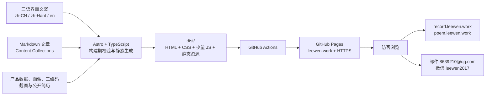

> 目的：定义 leewen.work 个人网站的定位、内容、视觉与转化设计，作为后续开发和运营的统一依据。　目标读者：lijiawen、网站设计与开发协作者。　如何阅读：先确认「定位与目标」，再按「页面设计」实施，最后依据「上线清单」验收。

# leewen.work 个人网站设计方案

## 1. 网站定位

### 1.1 一句话定位

**白板录屏工具与诗词图谱的产品展示入口。**

`leewen.work` 首先是 lijiawen 的个人产品展示与发现入口，让访客快速理解、体验和购买白板录屏工具、诗词图谱等产品。个人经历、专业成果和文章用于证明产品背后的判断力与长期执行能力，不与产品争夺首页注意力。

### 1.2 核心目标

按优先级排列：

1. **产品发现**：让首次访问者在 5 秒内知道有哪些产品、各自解决什么问题。
2. **产品转化**：让感兴趣的访客一次点击进入产品体验、试用或购买入口。
3. **产品信任**：用创作者经历、真实成果和产品相关文章降低用户的尝试顾虑。
4. **长期连接**：在不干扰产品浏览的前提下承接产品反馈、商业合作与职业机会。

### 1.3 目标访客

- 想提高教学、讲解、产品演示和知识分享效率的白板录屏用户。
- 喜欢诗词、传统文化，希望通过人物、时间和作品关系探索内容的用户。
- 从文章、搜索或社交平台进入，想进一步了解 lijiawen 产品组合的访客。
- 关注产品共创、企业合作、金融数据或 AI 应用能力的潜在合作方。

### 1.4 品牌关键词

**好理解、真有用、可信赖、有温度、独立创造。**

网站先传达产品价值，再补充创作者气质：

- 产品一面：用户问题明确、体验入口直接、截图真实、状态透明。
- 信任一面：22 年产品与系统经验、复杂业务落地能力、持续创作与维护。

## 2. 内容架构

### 2.1 主导航

- 首页
- 产品
- 文章
- 关于我
- 合作

右侧保留一个高对比主按钮：**查看产品**，直接跳到首页产品首屏；“合作”保留为普通导航项和页尾入口。导航同时提供 `简 / 繁 / EN` 语言切换，手机端语言切换放入菜单顶部。

### 2.2 页面地图

```text
leewen.work
├── /                         # 简体中文
│   ├── products/{slug}/
│   ├── articles/{slug}/
│   ├── about/
│   └── work-with-me/
├── /zh-hant/                 # 繁体中文
│   └── 同构页面
└── /en/                      # English
    └── 同构页面
```

首页首先承担产品发现与转化；独立产品站继续使用现有子域名：

- `record.leewen.work`：产品使用、试用或购买。
- `poem.leewen.work`：产品体验、内容浏览或购买。

首页主按钮直接进入产品子域名；主站产品详情页作为次级入口，负责为需要更多信息的访客解释“为什么值得用”。

### 2.3 三语规则

- 支持简体中文、繁体中文、英文，对应页面语言标记为 `zh-CN`、`zh-Hant`、`en`。
- `/` 及其子路径直接提供简体中文内容，不另外生成 `/zh-cn/` 副本，避免重复页面和不必要跳转。
- 首次访问不根据浏览器语言强制跳转，可在页面顶部做一次非打扰式语言建议，避免访客找不到原链接。
- 语言切换应尽量打开当前页面的对应翻译；若该页面没有译文，则回到目标语言首页并给出简短提示。
- 导航、页脚、按钮、SEO 信息、产品介绍、关于我和合作页必须完整翻译，不混用语言。
- 文章允许分语言独立发布；只有存在对应译文时才显示该语言切换项，避免用机器翻译占位。
- 简繁转换可以辅助生成初稿，但发布前必须人工核对地域用词、标点、专有名词和按钮长度。
- 产品名、域名、GitHub 地址、邮箱和数据成果保持一致；可翻译描述，不改动事实。

## 3. 首页设计

首页顺序固定为：

1. 产品首屏
2. 产品使用场景与差异
3. 产品截图或短演示
4. 创作者信任区
5. 产品相关文章
6. 联系与合作

### 3.1 产品首屏

首屏不设置品牌口号、大标题或介绍性副标题，导航下方直接并列展示两个同等权重的大型产品卡片。产品名称、用途、适合人群和体验按钮本身承担说明职责。

桌面端两张卡片同时进入首屏，手机端先完整显示第一张卡片，第二张紧随其后，不能被其他内容隔开。首屏不展示大幅个人肖像，不以个人履历、求职或合作作为主行动。

**白板录屏工具**

> 一边讲解，一边把思路完整录下来。适合教学、产品演示和知识分享。

- 适合：教师、培训者、产品经理、知识创作者。
- 媒体：真实界面截图或 6–10 秒静音演示。
- 主按钮：**立即体验**
- 链接：`https://record.leewen.work`

**诗词图谱**

> 从人物、时间和作品关系中，重新发现中国诗词。

- 适合：诗词爱好者、教师、学生、传统文化内容创作者。
- 媒体：真实图谱截图或 6–10 秒交互演示。
- 主按钮：**立即探索**
- 链接：`https://poem.leewen.work`

两个按钮直接访问产品子域名，不先经过主站详情页。产品卡可以提供次级“了解更多”链接进入主站产品详情，但不能增加体验路径的点击次数。

### 3.2 使用场景与产品差异

标题：**找到适合你的产品**

- 想边讲边画并把讲解录下来：选择白板录屏工具。
- 想从人物、时间和作品关系理解诗词：选择诗词图谱。
- 想了解功能细节、适用人群、产品状态和常见问题：进入对应产品详情页。

这一部分用真实用户任务组织内容，不罗列技术栈。每个场景都提供回到对应产品的行动按钮。

### 3.3 产品截图与演示

每个产品至少提供一张清晰截图；素材准备完成后优先升级为点击播放的短演示。

- 演示默认静音、不自动播放，不阻塞首屏加载。
- 截图必须展示核心操作，不使用无法验证功能的概念图。
- 媒体旁用三步以内说明“打开产品 → 完成关键操作 → 获得结果”。
- 演示结束后重复出现“立即体验 / 立即探索”按钮。

### 3.4 创作者信任区

标题：**产品背后的创作者**

这里使用 `MyResume/李家文肖像画彩铅1.jpg`，保留纸张纹理和完整人物，不将肖像放回产品首屏。推荐精简文案：

> 我是 lijiawen，一名拥有 22 年产品与系统经验的独立产品创作者。我长期处理复杂业务、数据和系统问题，现在把这些经验变成普通用户可以直接使用的产品。每个产品都由我持续设计、开发和改进。

可信标签：

`22 年产品与系统经验` · `10 年银行数据产品` · `PMP` · `从需求到可运行产品`

按钮：**进一步了解我**，进入“关于我”页面。完整的“我是谁 / 我相信什么 / 我在找什么”、银行数据经历和专业成果只在关于页面展开，不在首页形成大段履历。

涉及客户名称、数字成果和案例时，仅在关于页面或文章中使用可公开验证或已获许可的信息，不展示保密架构、数据和客户内部材料。

### 3.5 产品相关文章

标题：**了解产品如何使用与成长**

首页文章优先级：

1. 产品教程和快速上手。
2. 真实使用场景与案例。
3. 产品更新日志。
4. 产品设计与创作过程。
5. 与产品相关的需求分析、AI 和专业观点。

首批首页文章方向：

- 《如何用白板录屏工具完成一次清晰的产品讲解》
- 《白板录屏工具：从打开页面到导出录制》
- 《诗词图谱：从人物关系重新阅读一首诗》
- 《我为什么做诗词图谱》
- 《从需求到产品：两个独立工具的创作记录》

金融数据、监管科技和图数据库专业文章继续保留在文章中心，但只有与当前产品或用户任务直接相关时才进入首页推荐。

### 3.6 联系与合作

标题：**使用产品时遇到问题？**

> 欢迎告诉我你的使用体验、问题和建议。如果你有产品合作或一件值得共同完成的事，也可以直接联系我。

按钮顺序：

1. **查看全部产品**
2. **发送邮件**：`mailto:8639210@qq.com`
3. **添加微信 leewen2017**

微信展示现有二维码 `MyResume/leewen2017微信二维码.jpg`，账号文字作为备用；二维码旁注明“添加时请备注：产品名称 / 合作”，减少无效沟通。展示时保持原始黑白配色和完整白色静区，不裁切、不拉伸、不叠加装饰。

### 3.7 三语首页核心文案

三种语言使用完全相同的产品优先结构，不因语言不同把个人介绍移回首屏。

**繁体中文**

- 白板价值：**一邊講解，一邊把思路完整錄下來。適合教學、產品演示和知識分享。**
- 诗词价值：**從人物、時間和作品關係中，重新發現中國詩詞。**
- 产品按钮：**立即體驗 / 立即探索**
- 信任区标题：**產品背後的創作者**

**English**

- Whiteboard value: **Explain, draw, and record your ideas in one flow—for teaching, product demos, and knowledge sharing.**
- Poetry value: **Rediscover Chinese poetry through the relationships between people, time, and works.**
- Product buttons: **Try it now / Explore now**
- Trust heading: **The creator behind the products**

### 3.8 页面陪伴角色

- 首页产品相关区域使用一组完整人物透明插画作为陪伴角色；默认位于第一张产品卡左侧留白，不使用头像式小 icon，也不显示边框或容器底色。
- 角色在产品首屏、使用场景和开始步骤区域内跟随视口；创作者区域进入视口后隐藏，避免干扰文章与联系内容。
- 点击角色随机切换表情，约 3 秒后回到默认形象；不自动表演、不播放声音，并遵循系统“减少动态效果”设置。
- 鼠标与触摸可把角色拖到当前屏幕任意位置，桌面端和移动端分别记忆相对位置；拖动不得让角色丢失到视口之外。
- 宽屏人物高度约 180–240px；左侧留白不足时逐步缩小，手机端保持 120–150px 的完整人物。
- 与主要按钮、导航或语言切换重叠时临时缩小并降低透明度；键盘焦点使用人物轮廓光晕，不绘制矩形或圆角边框。
- 五张角色图片使用透明 WebP 并参与单文件内联；整组资源以不超过 1.5 MB 为上限。

## 4. 关键内页

### 4.1 产品列表与详情

产品列表不只陈列链接，还要表现产品的成熟过程。卡片统一包含“解决的问题、适合人群、产品状态、行动入口”。

每个主站产品详情页使用以下结构：

1. 用户正在遇到的问题。
2. 产品如何解决。
3. 3 个核心使用场景。
4. 截图或短演示。
5. 适合谁、不适合谁。
6. 价格或购买方式；未定价时明确写“免费试用”或“内测申请”。
7. 常见问题。
8. 前往产品子域名的行动按钮。

产品页应增加基础事件统计：产品卡片点击、试用点击、购买点击、合作按钮点击。只收集必要的匿名数据，并提供简短隐私说明。

### 4.2 关于我

“关于我”应是可信叙事，不直接复制完整简历。

推荐结构：

- “我是谁 / 我相信什么 / 我在找什么”三段式个人介绍。
- “我如何工作”：理解问题、建立模型、快速做出原型、持续验证。
- 代表经历时间线：富士康 → 中兴 → 金融科技创业公司 → 图数据库与银行数据 → 独立产品创作。
- 代表成果与专业资质。
- 可下载的精简 PDF 简历，公开版删除手机号等不需要公开的敏感信息。
- GitHub、微信、工作邮箱。

“关于我”正文采用“我是谁 / 我相信什么 / 我在找什么”三段式，既说明专业经历，也表达长期方向。以下为三语正式文案。

#### 简体中文

**我是谁？**

一名长期深耕银行数据与监管科技的产品经理。

近五年，我一直致力于探索图数据库在银行监管、流动性风险、FTP 与资产负债管理中的应用，把复杂的数据关系，转化为清晰、可追溯、可落地的系统。

**我相信什么？**

我相信，银行业务是 AI 服务最值得长期投入的领域之一。

这里有明确的规则、标准化的交付和大量可自动化的任务；同时，也需要真正理解监管、数据与业务的人，处理少数但关键的复杂判断。

监管不是阻力，而是专业能力的护城河。AI 不会取代行业经验，而会放大真正懂业务、懂数据、懂系统的人的价值。

**我在找什么？**

我在寻找真实而有价值的问题，并尝试把我的经验、快速理解复杂业务的能力与 AI 结合，转化为真正能够帮助他人的产品与解决方案。

我希望做的，不只是完成一项工作，而是持续创造清晰、可靠、可落地的价值。

#### 繁體中文

**我是誰？**

一名長期深耕銀行數據與監管科技的產品經理。

近五年，我一直致力於探索圖資料庫在銀行監管、流動性風險、FTP 與資產負債管理中的應用，把複雜的數據關係，轉化為清晰、可追溯、可落地的系統。

**我相信什麼？**

我相信，銀行業務是 AI 服務最值得長期投入的領域之一。

這裡有明確的規則、標準化的交付和大量可自動化的任務；同時，也需要真正理解監管、數據與業務的人，處理少數但關鍵的複雜判斷。

監管不是阻力，而是專業能力的護城河。AI 不會取代行業經驗，而會放大真正懂業務、懂數據、懂系統的人的價值。

**我在尋找什麼？**

我在尋找真實而有價值的問題，並嘗試把我的經驗、快速理解複雜業務的能力與 AI 結合，轉化為真正能夠幫助他人的產品與解決方案。

我希望做的，不只是完成一項工作，而是持續創造清晰、可靠、可落地的價值。

#### English

**Who am I?**

A product manager deeply engaged in bank data and regulatory technology.

For the past five years, I have focused on exploring how graph databases can be applied to banking regulation, liquidity risk, FTP, and asset-liability management—turning complex data relationships into clear, traceable, and implementable systems.

**What do I believe?**

I believe banking is one of the fields where AI services deserve sustained, long-term investment.

It offers clear rules, standardized deliverables, and many tasks that can be automated. At the same time, the few complex judgments that matter most require people who truly understand regulation, data, and business.

Regulation is not an obstacle; it is a moat built on expertise. AI will not replace industry experience. It will amplify the value of people who genuinely understand the business, the data, and the systems.

**What am I looking for?**

I am looking for real, worthwhile problems and exploring how to combine my experience, my ability to quickly understand complex businesses, and AI to turn them into products and solutions that genuinely help others.

I hope to do more than complete a task. I want to keep creating value that is clear, reliable, and practical.

### 4.3 文章

文章列表支持分类筛选，但首版不需要复杂搜索。详情页应包含：

- 标题、摘要、发布日期、阅读时长、分类。
- 舒适的正文排版与目录。
- 文末“这篇文章与你正在做的事有关吗？”合作入口。
- 上一篇 / 下一篇。
- 分享链接与文章永久地址。

文章以 Markdown 管理，便于写作、版本控制和生成纯静态页面。每篇文章至少配置：稳定文章标识、语言、标题、摘要、日期、分类、封面、是否发布、SEO 描述；不同语言版本通过稳定标识互相关联。

### 4.4 合作页

合作页不是泛泛的“联系我”，而是降低对方发起对话的门槛。

可承接的合作：

- 复杂 To B / 后台系统需求分析与产品方案。
- 金融数据、ALM、FTP、LCR、图数据库相关咨询。
- AI 产品原型、业务 Demo 与独立工具共创。
- 产品顾问、项目负责人或合适的长期岗位。

提供一份简单的联系模板：

> 我是谁 / 公司或项目：  
> 想解决的问题：  
> 当前阶段：  
> 希望的合作方式与时间：

首版纯静态网站优先使用 `mailto:` 和微信二维码，不自行保存访客信息。未来咨询量增加后，再接入有隐私声明的第三方表单服务。

## 5. 视觉设计

### 5.1 设计方向：理性纸张 × 手绘创造

以彩铅肖像的米白纸张、深蓝线条作为品牌起点。整体应像一本克制、现代的个人创作手册，而不是科技公司模板或传统招聘简历。

### 5.2 色彩

- 页面底色：纸张米白 `#F7F3EA`
- 卡片底色：暖白 `#FFFDF8`
- 主文字：墨色 `#20242B`
- 品牌深蓝：`#263B5A`
- 行动强调：陶土橙 `#C7653D`
- 次级文字：灰蓝 `#667085`
- 分割线：`#DED8CC`

陶土橙只用于主按钮、价格和关键链接；深蓝承担标题、导航和品牌识别，避免整页颜色过多。

### 5.3 字体与排版

- 中文标题：优先使用有书卷气但清晰的宋体类字体，系统回退到衬线字体。
- 中文正文：现代黑体类系统字体，保证跨设备加载速度。
- 英文标题与正文：使用清晰的无衬线字体，并针对英文词长检查按钮、导航和卡片换行。
- 正文最大宽度约 720px，文章行高 1.8。
- 页面内容最大宽度约 1180px。
- 所有字体必须设置系统回退，不让第三方字体阻塞首屏。

### 5.4 图形语言

- 使用细线、轻微铅笔纹理和不完全规则的下划线作为点缀。
- 产品截图保持清晰、端正，避免全部做成倾斜拼贴。
- 卡片圆角适中，阴影极轻，主要依靠边框和留白分层。
- 动效只使用淡入、轻微上移和按钮反馈，并尊重系统“减少动态效果”设置。

### 5.5 响应式

- 桌面端：首屏两张产品卡并列等宽展示，主文案保持紧凑，两个产品入口同时可见。
- 平板：优先保持产品双栏；空间不足时缩短辅助说明，但不隐藏任一产品按钮。
- 手机端：产品卡改为连续单列，白板录屏工具后立即展示诗词图谱，不插入个人介绍或合作内容。
- 创作者信任区在桌面端采用肖像与短文双栏，在手机端先显示短文和可信标签，再显示肖像。
- 所有产品截图不得裁掉关键界面，主按钮保持易点击。

## 6. 转化与运营建议

### 6.1 联系方式

使用 `8639210@qq.com` 作为网站公开工作邮箱。不要直接公开简历中的手机号，以降低骚扰与隐私风险。

固定展示：

- 微信：`leewen2017`
- GitHub：`https://github.com/wen001-git/`
- 工作邮箱：`8639210@qq.com`

可选渠道：

- LinkedIn：承接跨国、金融科技与职业合作。
- 微信公众号或知乎：承接中文长文分发。
- 即刻、小红书或视频号：发布产品演示和创作过程；只选一个能持续更新的平台。

不要首期同时运营所有平台。网站是内容源，其他平台负责分发并把读者带回 `leewen.work`。

### 6.2 产品商业化

每个产品都要有且只有一个当前主行动：

- 早期：免费体验 / 申请内测。
- 已验证：购买 / 订阅。
- 企业型：预约演示 / 咨询授权。

建议建立简单产品漏斗：

`文章或社交内容 → 产品详情 → 在线体验 → 购买或联系`

首期不要自建支付系统。若产品已经有购买方式，主站直接链接；否则先通过体验与合作咨询验证需求，再决定一次性购买、订阅或企业授权。

### 6.3 信任建设

后续逐步补充：

- 每个产品的真实使用场景和 30 秒演示。
- 用户评价、案例或使用数据；必须取得授权。
- “我为什么做这个产品”的创作日志。
- 清晰的产品状态、更新日期和联系入口。
- 公开可验证的成果来源链接。

## 7. 静态技术方案

### 7.1 架构结论

采用 **Astro + TypeScript + Markdown Content Collections + 原生 CSS + GitHub Actions / GitHub Pages**。Astro 在构建阶段生成完整的 HTML、CSS、少量 JavaScript 和图片资源，线上不运行 Node.js、数据库或自建后端。

选择这一架构的原因：

- Astro 默认适合内容型静态网站，能在构建时生成产品页、文章页和三语路由。
- 页面主体直接输出为 HTML，加载快、SEO 友好，JavaScript 失败时仍能阅读。
- Markdown 适合长期写作和 Git 版本管理，不需要额外维护 CMS。
- Astro Components 可复用导航、产品卡片、文章布局和 CTA，不需要引入 React 或 Vue 运行时。
- GitHub Actions 与 GitHub Pages 能形成“提交代码 → 自动构建 → 自动发布”的低维护流程。

### 7.2 系统架构图



运行时数据流非常简单：浏览器从 CDN 获取已经生成好的页面；产品按钮跳转到独立产品子域名，联系按钮打开邮件客户端或展示微信二维码。主站不接收和保存用户提交的数据。

### 7.3 技术栈与职责

| 层级 | 采用技术 | 职责 |
|------|----------|------|
| 静态生成 | Astro | 页面路由、布局、组件复用、构建静态 HTML |
| 类型与校验 | TypeScript + 内容集合 Schema | 在构建期检查产品和文章字段，阻止错误内容上线 |
| 内容 | Markdown | 管理三语文章正文、摘要与 SEO 元数据 |
| 界面 | Astro Components + 原生 CSS | 实现设计系统、响应式布局和可访问组件 |
| 浏览器交互 | 少量原生 JavaScript | 手机导航、语言建议、必要的交互反馈 |
| 自动发布 | GitHub Actions | 安装依赖、校验内容、构建并上传静态产物 |
| 托管 | GitHub Pages | 托管 `dist/`、绑定 `leewen.work`、启用 HTTPS |

首期不引入 React、Vue、状态管理库、数据库、登录系统或自建 API。未来若增加统计、表单或支付，应作为可替换的外部服务接入，不改变静态主架构。

### 7.4 三语路由与内容模型

路由固定为：

- 简体中文：`/`、`/products/`、`/articles/`、`/about/`、`/work-with-me/`
- 繁体中文：`/zh-hant/` 下的同构页面
- 英文：`/en/` 下的同构页面

核心内容类型：

```ts
type Locale = 'zh-CN' | 'zh-Hant' | 'en';

interface ProductEntry {
  id: string;           // 跨语言稳定标识
  locale: Locale;
  slug: string;
  name: string;
  summary: string;
  targetAudience: string;
  status: 'available' | 'testing' | 'coming-soon';
  image: string;
  externalUrl: string;
  primaryCta: string;
  seoDescription: string;
}

interface ArticleEntry {
  translationKey: string; // 关联同一文章的不同语言版本
  locale: Locale;
  slug: string;
  title: string;
  summary: string;
  publishDate: string;
  categories: string[];
  cover?: string;
  draft: boolean;
  seoDescription: string;
}
```

语言切换器通过 `id` 或 `translationKey` 查找当前内容的对应译文。没有译文时不生成空白页面，也不展示无效语言链接；用户主动切换时回到目标语言首页并给出简短提示。

### 7.5 项目目录

```text
src/
├── components/            # 导航、产品卡片、语言切换、CTA
├── content/
│   └── articles/          # 按语言管理的 Markdown 文章
├── data/                  # 三语产品和站点数据
├── i18n/                  # zh-CN、zh-Hant、en 公共界面文案
├── layouts/               # 基础页面和文章布局
├── pages/                 # Astro 文件路由和静态端点
└── styles/                # 设计变量、全局和组件样式
public/
├── images/
├── products/
├── resume/
├── favicon.*
├── robots.txt
└── social-card.jpg
```

构建输出统一写入 `dist/`，该目录是部署产物，不作为内容源手工编辑。

### 7.6 构建与部署

本地开发流程：

```text
npm install
npm run dev
npm run build
npm run preview
```

`npm run build` 必须完成三语内容 Schema 校验、静态页面生成、站点地图和 RSS 输出。主分支更新后，GitHub Actions 使用锁定依赖构建 `dist/`，再发布到 GitHub Pages。

域名部署规则：

- GitHub Pages 绑定主域名 `leewen.work` 并强制 HTTPS。
- `www.leewen.work` 统一跳转到 `leewen.work`。
- `record.leewen.work` 与 `poem.leewen.work` 保持现有独立部署，不被主站 DNS 配置覆盖。
- 构建或内容校验失败时停止发布，线上继续保留上一个成功版本。

### 7.7 SEO 与分享

- 每页独立的标题、描述、规范链接和社交分享图。
- 每组三语对应页面互相输出 `hreflang="zh-CN"`、`hreflang="zh-Hant"`、`hreflang="en"` 与 `x-default`；`zh-CN` 和 `x-default` 指向根路径下的简体页面，规范链接指向当前语言 URL。
- 添加 `Person`、`Product`、`Article` 的结构化数据。
- 生成包含三语 URL 的 `sitemap.xml`、`robots.txt`；RSS 按语言分别输出。
- 产品名称、解决的问题与目标用户应直接出现在 HTML 文本中。
- 图片使用明确尺寸、现代格式、懒加载与准确替代文字。
- 配置 `www.leewen.work` 到 `leewen.work` 的统一跳转，避免重复收录。

### 7.8 可访问性与性能

- 文字与背景达到清晰对比，所有操作可用键盘完成。
- 肖像替代文字建议：”lijiawen 的彩铅人物肖像”。
- 主体内容不依赖 JavaScript 才能显示。
- 首屏不自动播放大视频；产品演示使用封面点击播放。
- 图片按显示尺寸压缩，优先保证手机网络下快速打开。

## 8. 首期交付范围

### 8.1 MVP 必须完成

- 首页、产品列表、两个产品介绍、文章列表与详情、关于我、合作页。
- 首页首屏并列展示两个产品，并提供直达产品子域名的主按钮。
- 简体中文、繁体中文、英文三套完整核心页面文案及语言切换。
- 中英文品牌名、彩铅肖像、基础视觉系统。
- 微信、GitHub、工作邮箱入口。
- 至少 2 篇正式文章或 3 篇文章占位摘要。
- SEO、RSS、站点地图、404 页面。
- 手机、平板、桌面端适配。

### 8.2 暂不包含

- 账号登录、评论系统、数据库。
- 自建支付和订单系统。
- 复杂站内搜索。
- 重型动画、实时聊天和未经验证的营销弹窗。

## 9. 上线验收清单

- 访客 5 秒内能说出至少一个产品的用途，并能识别对应的体验入口。
- 白板录屏工具与诗词图谱在首屏或紧邻首屏同等级展示，不以个人肖像、履历、求职或合作信息抢占主位。
- `简 / 繁 / EN` 可访问全部核心页面，切换后尽量保持在同一内容；页面的 `lang`、标题、描述和 `hreflang` 正确。
- 任一语言缺少文章译文时不产生空页面、错误链接或机器翻译占位。
- 两个产品都能从首页一次点击进入对应产品子域名的体验或购买入口。
- 完整个人介绍保留在关于页面；首页只展示 2–3 句创作者介绍和可信标签。
- 手机端首屏无横向滚动，按钮清晰可点。
- 所有外链有效，子域名使用 HTTPS。
- 不公开手机号和未授权客户资料；`8639210@qq.com` 已确认为公开工作邮箱。
- 每篇文章都有标题、摘要、日期、分类和分享信息。
- 页面关闭 JavaScript 后仍能阅读主要内容。
- 404、站点地图、RSS、社交分享图可正常访问。
- 建立最小转化统计，但不采集不必要的个人信息。

## 10. 推荐首页文案总览

**导航品牌名**：`LEEWEN / lijiawen`

**导航主行动**：查看产品

**白板主行动**：立即体验

**诗词主行动**：立即探索

**场景区标题**：找到适合你的产品

**信任区标题**：产品背后的创作者

**文章区标题**：了解产品如何使用与成长

**结尾标题**：使用产品时遇到问题？

**页脚说明**：`© lijiawen · 独立产品创作者 · leewen.work`

## 变更记录

| 日期 | 变更内容 |
|------|----------|
| 2026-07-29 | 新增首页左侧可拖动陪伴角色的显示范围、响应式尺寸、随机表情、位置记忆、避让和无边框规则；why：在不遮挡产品转化入口的前提下增加个人网站的创意与陪伴感 |
| 2026-07-24 | 更新“我在找什么”的三语文案，从银行数据合作限定扩展为寻找真实问题并用经验、业务理解与 AI 创造可落地价值；why：采用用户最新自我表达 |
| 2026-07-24 | 删除首页品牌口号、大标题和介绍性副标题，让导航后直接展示双产品卡片；why：用户认为宏大口号尴尬，希望页面只聚焦具体产品 |
| 2026-07-24 | 将首页重构为双产品并列首屏、一次点击体验和个人背书辅助，并补齐三语核心文案及产品导向验收标准；why：网站首要目标是让用户了解和使用产品，而非优先介绍个人履历 |
| 2026-07-24 | 将 Astro、TypeScript、Markdown、GitHub Actions 与 GitHub Pages 确定为正式技术架构，并加入三语“关于我”定稿；why：让设计方案可直接指导开发并准确表达用户的银行数据与监管科技定位 |
| 2026-07-23 | 将简体中文、繁体中文、英文三语整站纳入首期范围，补充 URL、切换、内容关联与多语言 SEO 规则；why：用户明确要求网站支持三种语言 |
| 2026-07-23 | 登记 leewen2017 微信二维码素材并补充展示规范；why：确保后续页面直接使用用户提供的正式二维码且不因视觉加工影响扫码 |
| 2026-07-23 | 将网站公开工作邮箱确定为 8639210@qq.com，并修正简历脱敏与上线验收要求；why：用户已明确授权该邮箱用于工作联系 |
| 2026-07-23 | 初始创建设计方案；基于个人简历、产品域名、社交账号和彩铅肖像，定义网站定位、内容架构、视觉系统、转化路径与静态实现要求 |
